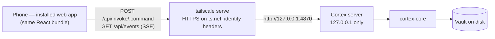

# Serve mode: Cortex on a phone, over Tailscale

Status 2026-09-14: plan. Nothing here is built.

The desktop app serves itself to your own devices. A phone on the same
tailnet opens `https://<machine>.<tailnet>.ts.net`, adds it to the home
screen, and from then on opens Cortex like an app: the same notes,
collections, trackers, search and capture, on the vault that already lives on
the desktop. The phone is a window onto that vault, not a second copy of it —
there is nothing to sync, nothing to merge on a phone, and agents keep running
where they already run.

`docs/MOBILE.md` is the other path: a native Tauri build with its own clone
of the vault. The two are complementary. Serve mode ships sooner, needs no
store or signing, works on iOS and Android from one build, and keeps the
agentic half of the app on the host — but it needs a connection to that host.
The native app works offline and costs a platform port per target.

## What a phone gets

- **In v1:** reading and editing notes, the property panel, collection views
  (table, list, board, gallery, calendar, timeline, charts, stats), trackers
  with Log today, search, quick capture, Today's note, the settings that make
  sense per vault. The phone layout already exists — the `data-viewport="phone"`
  rules, the drawer sidebar, the bottom-sheet terminal — so this is a
  transport, not a redesign.
- **Online only, by design.** With no route to the host, the installed app
  opens its shell and says so. Reading on the move without a connection is
  what a published site (`docs/publishing.md`) or the native app is for.
- **Not in v1:** the terminal and agents (an opt-in in Phase 5, because it is a
  shell on the host), switching vaults, anything that needs a folder picker on
  the host (publish into a folder, import a folder), in-app updates.

## How it fits together

### The seams already exist

**Frontend.** Every backend call goes through one import of `invoke`, in
`src/lib/commands.ts` (123 calls). Push events arrive through four `listen`
sites: `vault://changed` (Shell, Settings), `theme://changed` (`lib/theme.ts`),
and `terminal://data` / `terminal://exit` (`TerminalPane.tsx`). Vault images
already come back as data URIs through commands (`Editor.tsx`), so there is no
asset protocol to replace. The only other native imports are the dialog
plugin (four files), `shell.open` (`lib/links.ts`) and the updater. Nothing in
the frontend checks yet which host it runs in.

**Backend.** About 120 `#[tauri::command]` functions live in
`src-tauri/src/commands/`, and nearly all of them are thin wrappers — take the
vault path from state, call `cortex_core`, return the result. `cortex-core`
itself has no Tauri dependency. What the wrappers take from Tauri:

| Parameter | Uses | What a server supplies instead |
|---|---|---|
| `State<VaultState>` | 114 | the served vault's path |
| `State<DbState>` | 33 | the same open index handle |
| `AppHandle` | 19 | per command: config and cache directories (`recent.rs`, `packs.rs`), the vault lifecycle (`open_vault` starts the watcher), the index (`search_notes`), desktop-only (`update_config`) |
| `State<SelfWrites>` | 2 | the watcher's own-write suppression, shared |
| `State<EmbedFrames>` | 1 | the embed allow-list, shared |

### One command table, two transports

The load-bearing change, the way `RemoteOps` was for the native path.

- The wrapper bodies move into a transport-neutral module — a new
  `crates/cortex-app` crate, or `cortex_core::api` — as plain functions over a
  context: `Ctx { vault, db, self_writes, frames, emit }`. Desktop behaviour
  does not change: the Tauri commands become one-line calls into it.
- Each command is declared **once**, in a macro table that expands to both the
  `#[tauri::command]` function and an entry in the HTTP dispatcher: name →
  deserialize the arguments → call → serialize the result or the error string
  the frontend already expects.
- A parity test asserts the Tauri handler set and the HTTP set are the same,
  minus an explicit desktop-only list, so a command cannot exist on one
  transport by accident.
- An `Emitter` trait replaces direct `AppHandle::emit`: the Tauri
  implementation emits as today; the server's pushes into a
  `tokio::sync::broadcast` channel that `/api/events` streams as Server-Sent
  Events.

### The frontend transport

- `src/lib/transport.ts` exports `invoke` and `listen`. Inside Tauri
  (`window.__TAURI_INTERNALS__` present) they are the Tauri functions; in a
  browser, `invoke(cmd, args)` is `POST /api/invoke/<cmd>` with a JSON body, and
  `listen(name, cb)` filters one shared `EventSource` on `/api/events`.
  `commands.ts` and the four listeners import from here instead of
  `@tauri-apps/api`.
- The event stream reconnects with backoff and on `visibilitychange` — iOS
  drops connections from a backgrounded home-screen app — and after every
  reconnect the app refreshes as if `vault://changed` had fired, since events
  sent while it was away are gone.
- `GET /api/capabilities` says what this host can do
  (`{ folders, terminal, updater, reveal }`); served mode reports them false and
  the UI hides those affordances rather than failing on them.
- **One build.** The server serves the same `dist/` the desktop app bundles.

## Where the server runs

One library, two hosts.

1. **Inside the desktop app** — Settings → Serve to my devices, off by default.
   Same process, so there is still exactly one index writer and the watcher's
   own-write suppression keeps working. It serves whichever vault is open and
   shows the tailnet URL with a QR code to scan from the phone. **Ship this
   first:** it is the safe shape.
2. **`cortex serve --vault <path>`** — the same server from the CLI crate
   (`tokio` is already a dependency; add `axum`) for a machine with no desktop
   session, such as a home server. It runs `open_vault`'s scaffolding and the
   watcher at startup. The spike (Phase 0) starts here because it is the
   fastest loop; it ships alongside Phase 2.

**Writer lock.** Nothing today stops two processes — the desktop app and a
`cortex serve` — from indexing, watching and auto-committing the same vault at
once. Opening a vault takes `.brain/writer.lock` (pid and hostname; `.brain/`
is already gitignored); a second writer refuses with a message naming the
first, and a stale lock whose pid is gone is taken over.

**Settings live on the machine, not in the vault.** `.cortex/settings.yaml` is
committed and syncs to every clone, and a vault synced to two machines must not
make both of them serve. Serve settings go in the app's config directory
(`serve.yaml` beside the recent-vaults list), and the token never touches the
vault — the same rule `docs/MOBILE.md` sets for the git token.

## Tailscale and security

- **Loopback only.** The server binds `127.0.0.1`. It never listens on
  `0.0.0.0` or a LAN address.
- **Tailscale terminates TLS.** `tailscale serve --bg http://127.0.0.1:4870`
  publishes it at `https://<machine>.<tailnet>.ts.net` with a real certificate
  (MagicDNS and HTTPS certificates enabled in the tailnet admin console; the
  `serve` CLI changed across versions, so check `tailscale serve --help`). A
  real certificate matters: service workers and home-screen install need a
  secure context on both iOS and Android.
- **Identity from Tailscale.** Requests proxied by `tailscale serve` from a
  tailnet user carry `Tailscale-User-Login` and `Tailscale-User-Name`. The server
  requires the login and checks it against `allow` (default: the host's own
  Tailscale login). Requests that arrive without it — including anything from
  Funnel, and tagged devices — are refused.
- **An optional pairing token** closes the remaining gap: because the server is
  loopback-only, headers could otherwise be forged only by a process already
  running on the host. With `token` set, the phone enters it once and the app
  keeps it; the server checks both.
- **Never Funnel.** Serve mode is for your tailnet. The docs and the Settings
  row say so, and the identity check refuses Funnel traffic regardless.
- **Commits say who.** Edits from a phone auto-commit as the host's git
  identity today. When the Tailscale login maps to a member in
  `.cortex/members.yaml`, the server sets that member as the author.
- **The same CSP.** The server sends the `csp` from `tauri.conf.json` as a
  header; `connect-src 'self'` already covers same-origin `/api`.
- **Nothing new to reach.** Only commands in the table are callable, every one
  already takes vault-relative paths, and static files come from `dist/` only.

## The installed app

- `public/manifest.webmanifest`: `name` Cortex, `start_url` and `scope` `/`,
  `display: standalone`, background and theme colours from the tokens, icons at
  192 and 512 plus a maskable 512 — `src-tauri/icons/icon.png` is 512×512, the
  192 is generated from it.
- A service worker caches the **app shell only**, keyed by build, and never
  caches `/api/*`: vault data stays on the host. Offline, the shell opens and
  shows "Can't reach <machine>" with a retry. `vite-plugin-pwa` (MIT) builds
  the precache list; registration happens only outside Tauri.
- iOS: `apple-touch-icon`, `apple-mobile-web-app-capable`,
  `apple-mobile-web-app-status-bar-style`, and `viewport-fit=cover` with
  `env(safe-area-inset-*)` on the shell's edges. Installing is Share → Add to
  Home Screen; Android Chrome offers its own install prompt.

## Desktop-only affordances in served mode

| Feature | Where | In served mode |
|---|---|---|
| Open or create a vault (folder dialog) | `hooks/useVault.ts` | hidden — the server serves one vault |
| Publish into a folder, gh-pages | `PublishModal.tsx` | hidden — a host-side action |
| Import a folder | `ImportModal.tsx` | hidden |
| Import a file (CSV, Notion zip) | `ImportModal.tsx` | `<input type="file">`, sent as bytes (the command gains a bytes variant) |
| Export HTML (save dialog) | `lib/export.ts` | a browser download |
| Open a link | `lib/links.ts` (`shell.open`) | `window.open`, same http / https / mailto allow-list |
| Paste an image (`wl-paste`) | `commands/clipboard.rs` | the browser's paste event; a file input on phones |
| Terminal and agents | `TerminalPane.tsx`, `terminal.rs` | hidden until Phase 5 |
| Updates | `lib/updater.ts` | hidden — the host updates |
| Reveal in the file manager | `commands/notes.rs` | hidden |
| Recent vaults, desktop palette file | `recent.rs`, `theme.rs` | not applicable; the phone follows the host's palette through `theme://changed`, or its own light/dark |

## Phases

**Phase 0 — Spike (2–3 days).** `cortex serve` with a hand-written dispatcher for
about ten read commands (`list_notes`, `read_note`, `list_tags`, `search_notes`,
`get_settings`, `run_view`, `run_tracker`, …), the transport shim in
`commands.ts`, `dist/` served statically, reached from a phone through
`tailscale serve`.
*Exit:* a phone on the tailnet opens a note and a tracker, read-only.

**Phase 1 — One command table (1–2 weeks).** The transport-neutral module and
macro, the `Emitter` trait, `/api/events`, the parity test.
*Exit:* every command not on the desktop-only list answers over HTTP, the parity
test passes, and the existing test suites pass unchanged.

**Phase 2 — Hosting and security (3–5 days).** Serve to my devices in Settings,
loopback bind, identity headers and `allow`, the optional token, the writer lock,
commit authors from Tailscale logins, the URL and QR code; `cortex serve` for
headless hosts.
*Exit:* a tailnet user outside `allow` gets 403, a request with no identity gets
401, and a second writer on the same vault is refused.

**Phase 3 — The installed app (2–3 days).** Manifest, icons, service worker, iOS
meta and safe areas, reconnect on visibility.
*Exit:* installs from Safari on iOS and Chrome on Android, opens standalone, and
recovers after an hour in the background.

**Phase 4 — Served-mode polish (3–5 days).** `/api/capabilities` and the hidden
affordances, file upload, downloads, quick capture and Today tuned for a thumb.
*Exit:* no control on a phone leads to an error.

**Phase 5 — Optional: the terminal from a phone.** The host's pty session
streamed over a WebSocket to the existing terminal pane, behind a `terminal`
setting that is off by default — it is a shell on the host.
*Exit:* an agent CLI runs on the host from the phone, and only when enabled.

## Risks and open questions

- **Background life on iOS.** A home-screen app loses its connection when
  backgrounded and its storage can be evicted. The reconnect-and-refresh rule
  handles the first; caching only the shell makes the second harmless.
- **Images as data URIs.** Fine for notes with a few images; if phones feel it,
  add a streaming `GET /api/file` with the same path checks.
- **Desktop and phone on the same note.** In the in-app host both see
  `vault://changed` and the open editor reloads, but simultaneous typing in one
  note is last write wins, as it is between two desktop windows today. The
  co-editing relay (`collab_url`) is the answer if that becomes common.
- **`open_vault` scaffolds on first open.** The server runs the same function at
  startup, so a fresh vault served headless gets the same skeleton.

## Not in this plan

Offline editing on the phone (the native path in `docs/MOBILE.md`), exposure
to the public internet, serving several vaults from one server, push
notifications.
