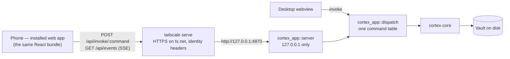

# Serve mode: Cortex on a phone, over Tailscale

Status 2026-09-15: built. The desktop app behaves as before; serving is off
until you switch it on.

The desktop app serves itself to your own devices. A phone on the same
tailnet opens `https://<machine>.<tailnet>.ts.net`, adds it to the home
screen, and from then on opens Cortex like an app: the same notes,
collections, trackers, search and capture, on the vault that already lives on
the desktop. The phone is a window onto that vault, not a second copy of it —
there is nothing to sync, nothing to merge on a phone, and agents keep running
where they already run.

`docs/MOBILE.md` is the other path: a native Tauri build with its own clone of
the vault. The two are complementary. Serve mode needs no store or signing,
works on iOS and Android from one build, and keeps the agentic half of the app
on the host — but it needs a connection to that host. The native app works
offline and costs a platform port per target.

## Using it

### From the desktop app

1. Settings → **Serve to my devices** → switch on *Serve this vault to my
   devices*. The app starts a server on `127.0.0.1:4870` for whichever vault is
   open, and remembers to do so on the next launch.
2. Run the command the page shows, once, in a terminal:
   `tailscale serve --bg http://127.0.0.1:4870`. That puts the server on your
   tailnet at this machine's HTTPS name. The app never runs it for you: it
   changes what this machine offers on your network, so it stays your call.
3. On the phone, open the address shown (or scan the QR code), then add it to
   the home screen — on iPhone Share → Add to Home Screen, on Android the
   install prompt or ⋮ → Install app.

Installing needs HTTPS, so MagicDNS and HTTPS certificates must be on in the
Tailscale admin console; the page warns when they aren't.

### Without a desktop session

```sh
cd path/to/vault
cortex serve                       # Tailscale logins; this machine's own by default
cortex serve --allow you@example.com --allow partner@example.com
cortex serve --token               # sign devices in with a pairing code instead
cortex serve --port 5000 --dist path/to/dist --terminal
```

`cortex serve` opens the vault the way the desktop app does — index, watcher,
writer lock — prints the address, who can sign in and the `tailscale serve`
command, and serves until Ctrl-C. It needs the built frontend: `npm run build`
in a checkout, or `--dist` / `$CORTEX_DIST` pointing at one.

### Who can sign in

- **Tailscale accounts** (the default). A request must come through
  `tailscale serve` from a tailnet user whose login is on the allow-list. An
  empty list means this machine's own login. Requests without Tailscale's
  identity headers — including anything from Funnel, and tagged devices — are
  refused.
- **Pairing code.** Devices enter a code once; the server trades it for an
  HttpOnly, SameSite=Strict cookie (Secure behind HTTPS). For a network without
  Tailscale, or trying it on this machine. With Tailscale accounts, a code can
  also be set as a second check.

Settings and the code live in this machine's app config directory
(`serve.yaml`, readable by you only), never in the vault: `.cortex/settings.yaml`
is committed, and a vault synced to two machines must not make both of them
serve.

### One writer per vault

The desktop app and `cortex serve` each index, watch and auto-commit the vault
they hold, so opening a vault takes `.brain/writer.lock`. A second host is
refused with a message naming the first; a lock left by a process that has gone
is taken over. One-shot writers — `cortex set`, an editor, an agent — never look
at it; the watcher is how the host sees what they did.

## What a served device can do

Everything in a vault: reading and editing notes, properties, every collection
view, trackers and Log today, search, the graph, comments, templates and packs,
settings that belong to the vault, git status and history. Edits it commits are
authored by the vault member whose email is the device's Tailscale login
(`.cortex/members.yaml`); otherwise they are this machine's, as always.

What it does differently or not at all:

| Feature | In the served app |
|---|---|
| Import a CSV or a Notion export zip | The browser's file chooser; the file waits in the vault's gitignored `.brain/uploads/` until imported |
| Import a folder (Markdown, unpacked Notion) | Desktop only |
| Export a note or a collection | A browser download |
| Open a link | A new tab, with the same http / https / mailto allow-list |
| Paste an image | The browser's own paste event |
| Terminal and agents | Off unless this machine switches *Let devices use the terminal* on — it is a shell here |
| Publish a site | Desktop only — it writes into a folder or pushes from this machine |
| Open or switch vaults, Leave vault | Desktop only — the server serves one vault |
| Reveal in the file manager, in-app updates, the terminal agent setting | Desktop only |

The server enforces these per request; the interface only leaves out what would
fail.

## How it fits together



### One command table, two hosts

`crates/cortex-app` is the application layer both hosts share: the commands
(moved out of `src-tauri`, unchanged in behaviour), the vault watcher, the
palette follower, the terminal, the writer lock and the server. Every command
runs against one `AppCtx` holding what used to be seven Tauri states.

`cortex_app::dispatch` is the table: each command's name, its mode and its
exposure, and one `dispatch(ctx, name, args)` that turns the JSON the frontend
sends into a call. The desktop app's invoke handler (`src-tauri/src/host.rs`)
routes every call through it — a *sync* command inline, as Tauri always ran it,
a *blocking* one on the blocking pool — and falls back to the few commands it
still defines itself (the updater, the Wayland clipboard, serving). The server
routes HTTP through the same function. `crates/cortex-app/tests/parity.rs` reads
`src/lib/commands.ts` and the desktop handler list and fails when the frontend
calls a command no host defines, or when the two lists overlap.

Events go out through an `Emitter` trait: the desktop attaches one that forwards
to its webview, a running server one that feeds its event stream, and both can
be attached at once.

### The transport

`src/lib/transport.ts` is the one place the frontend reaches its backend. Inside
the desktop app `invoke` and `listen` are Tauri's; in a browser they are
`POST /api/invoke/<command>` and one shared `EventSource`. Two rules keep the
browser faithful to the desktop: *sync* commands go through a single queue, so
two quick saves arrive in the order they were made, as they did on the desktop's
main thread; and after every reconnect `vault://changed` fires once with
"everything may have changed", because events sent while a phone slept are gone.

`src/lib/host.ts` asks `/api/capabilities` whether the browser is signed in and
what this host allows; the front door (`PairScreen`) handles *not signed in*,
*can't reach the server* and *no vault open*.

## Security

- **Loopback only.** The server binds `127.0.0.1`. Tailscale terminates TLS and
  forwards.
- **Identity or code on every API request**, as above. Static files — the
  open-source app shell — are served without it; nothing under `/api` is.
- **Only the app's own requests.** A Tailscale login is proved by a header the
  proxy attaches to whatever the browser sends, so a page on another site could
  otherwise post to the vault in the background. Every `/api` request must come
  from this app's own origin (`Sec-Fetch-Site`, or `Origin` against the address
  asked for), and every body must be JSON — which a cross-site form or a
  no-questions-asked fetch cannot claim. Requests from a program rather than a
  browser (`curl`, scripts) carry no site and are unaffected.
- **Paths stay inside the vault.** Arguments that name a place (`path`,
  `source`, `into`, …) must be vault-relative with no `..`; absolute paths are
  refused. Commands that take host paths or drive the desktop answer 404, the
  terminal 403 unless switched on, and the palette command answers with the
  vault's own `theme_file` whatever path it is sent.
- **Uploads** are staged under the vault's `.brain/uploads/<random id>/` and
  addressed by that handle only; requests are capped at 96 MB.
- **Headers.** The app's CSP, `nosniff` and `no-referrer` on every file.

## The installed app

`public/manifest.webmanifest` and `public/icons/` (generated from
`src-tauri/app-icon.svg`) make it installable; `index.html` carries the iOS
metadata and `viewport-fit=cover`, and `#root` keeps to the safe area. A small
Vite plugin writes `sw.js` at build time with that build's file names: it caches
the app shell only — never `/api` — so the app opens instantly and, offline,
shows its own "can't reach" screen. It registers only outside the desktop app.

## Where this differs from the plan

- **A dispatch function, not a macro.** The plan had each command declared once
  in a macro expanding to both a Tauri command and an HTTP route. One function
  both hosts call does the same with less machinery, and parity holds by
  construction; the parity tests cover what's left.
- **A hand-written service worker** instead of `vite-plugin-pwa`: the shell
  cache is a few lines, and no dependency.
- **The terminal needs no WebSocket.** Its existing commands run over HTTP, its
  output arrives on the event stream, and the ordered queue keeps keystrokes in
  order.
- **Imports upload files** rather than gaining bytes variants of every import
  command, and folder imports stay on the desktop.

## Not in this build

Offline editing on the phone (the native path in `docs/MOBILE.md`), running
`tailscale serve` automatically, exposure to the public internet, serving
several vaults from one server, push notifications.
